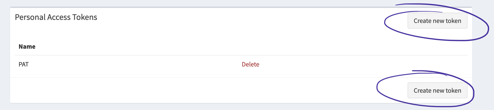
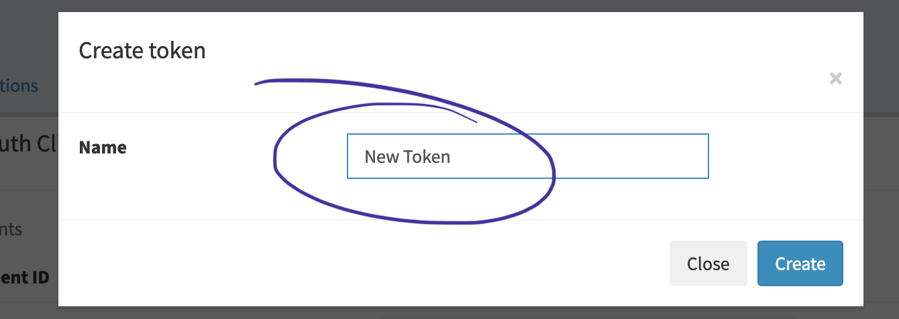
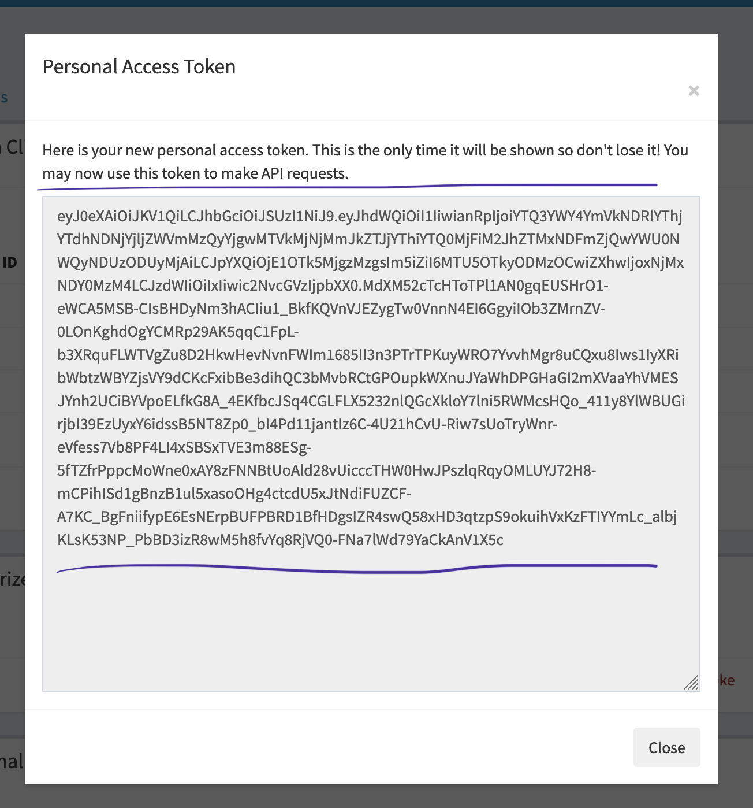
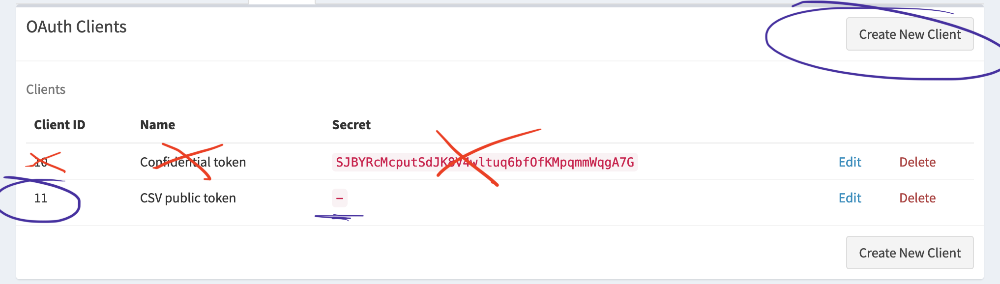
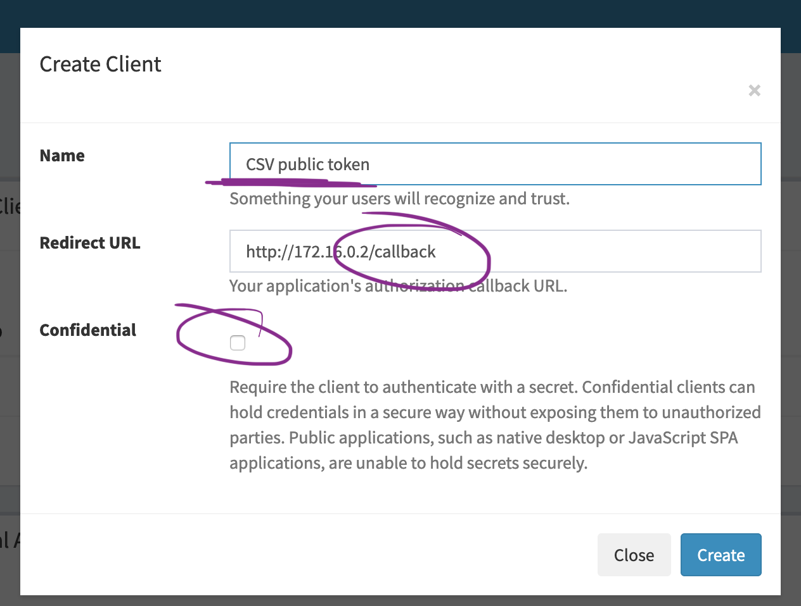

# Configure installation

There are a few pieces of configuration required for the Firefly III CSV import tool. It depends on how you want to run the CSV importer:

You will *always* need the URL / IP address of your Firefly III instance.

Then, the choice is yours:

1. A Personal Access Token. Use this method when you're the only one using the CSV importer and you're sure of its security.
2. A Client ID. Use this method when you're the only one using the CSV importer, but you want extra confirmation before it'll work.
3. *Nothing*, which is easiest to configure but requires some extra configuration during use.

## Configuration location

The configuration values are stored in environment variables, `FIREFLY_III_URI`, `FIREFLY_III_ACCESS_TOKEN` and `FIREFLY_III_CLIENT_ID` respectively. You can use the `.env` file to store them, use Docker's `-e` flag to set them or use your operating system to set these values.

## Personal Access Token

You can generate your own Personal Access Token on the Profile page. Login to your Firefly III instance, go to "Options" > "Profile" and find the "Personal Access Tokens" at the bottom of the page. Create a new Personal Access Token by clicking on "Create New Token". Give it a recognizable name and press "Create".

The Personal Access Token is pretty long. Use a tool like Notepad++ or Visual Studio Code to copy-and-paste it.







## Client ID

You can generate your own client ID on your Profile page (under OAuth). This is the ID you need when you want to share the CSV importer with multiple people, or when you want to allow others to use the same instance of the CSV importer.

Make sure you uncheck the "confidential" checkbox. 

It is **very important** that the callback URL is correct. The callback is the following:

```
http://[CSV IMPORTER]/callback
```

Some common examples include:

* [http://172.16.0.2/callback](http://172.16.0.2/callback) (172.0 is a common IP range for Docker hosts)
* [https://csv-importer.home/callback](https://csv-importer.home/callback) (Some users have fancy local addresses. Notice the TLS)
* [http://10.0.0.15/callback](http://10.0.0.15/callback) (10.0.0.x is often used when using Vagrant)

But ALWAYS add `/callback` or you'll run into weird errors later.






## URL or IP

You need to know the IP address or website address of your own Firefly III instances. In many cases this is simply `http://localhost`, but if you're a fancy user it might be something like `https://finances.example.com` or something similar.

You should know this when generating the token (see above).

### Localhost and Docker? Be careful!

If you host Firefly III on `http://localhost` and you're using Docker, beware. The CSV Importer may *not* be able to contact Firefly III. From the perspective of the CSV importer, "localhost" is referring to the CSV importer itself, not to Firefly III. 

Make sure you use the internal IP address of your Firefly III Docker container. You can get this IP address by using the following command:

```
docker inspect -f '{{range .NetworkSettings.Networks}}{{.IPAddress}}{{end}}' CONTAINER
```

Instead of `CONTAINER`, use the container ID of your Firefly III installation.
