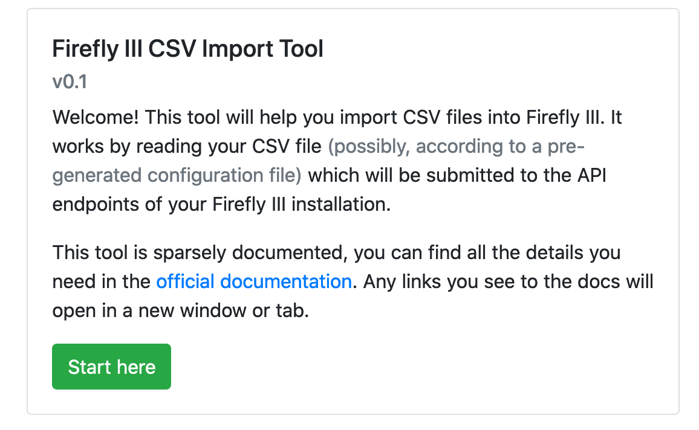

# Self hosted

In order to run the CSV importer on your own machine, you'll need You need a working LAMP, LEMP or WAMP running PHP 7.3 and access to the command line. The installation routine for the CSV importer is basically the same as it is for Firefly III itself.

If you don't have one, search the web to find out how to get one. Make sure you're running PHP 7.3. There are many tutorials that will help you install one. Here are some Google queries to help you.

1. [Install a LAMP stack with PHP 7.3](https://www.google.com/search?q=lamp+stack+php+7.3)
2. [Upgrade Ubuntu PHP 7.3](https://www.google.com/search?q=upgrade+ubuntu+php+7.3)
3. [PHP 7.3 raspberry pi](https://www.google.nl/search?q=PHP+7.3+raspberry+pi)

You won't need to set up a database.

## Preparing your server

### Extra packages

Install the following PHP modules:

* PHP BCMath Arbitrary Precision Mathematics
* PHP JSON

You can search the web to find out how to install these PHP modules. Some may be installed already depending on your system. Use `phpinfo()` to find out.

### Installing composer

If you have sudo rights (try `sudo ls`) you can install composer using the following command:

```bash
curl -sS https://getcomposer.org/installer | sudo php -- --install-dir=/usr/local/bin --filename=composer
```

Verify the installation of composer using the following command.

```bash
composer -v
```

If you have no sudo rights, you can simply [download composer](https://getcomposer.org/download/) with the instructions under the header "manual download". Use `php composer.phar` instead of `composer` in the instructions ahead.

This concludes the server preparations. If you're having trouble with (parts of) this step, please check out the :ref:`Server FAQ <faqselfhosted>`.

## Installing Firefly III CSV importer

### Main command

Browse to `/var/www` which is probably the directory where your web server is configured to find its files.

Enter the following command. 

```bash
composer create-project firefly-iii/csv-importer --no-dev --prefer-dist csv-importer <latest>
```

You should replace `<latest>` with the latest version, which you can find on the [Firefly III CSV importer version page](https://version.firefly-iii.org/).

If this gives an error because of access rights, prepend the command with `sudo`. Then fix the access rights:

```bash   
sudo chown -R www-data:www-data csv-importer
sudo chmod -R 775 csv-importer/storage
```

### Configuration

In the `csv-importer` directory you will find a `.env` file. Open this file using your favorite editor. There are instructions what to do in this file.

## Accessing the CSV importer

It depends on your installation and web server, but usually you can access the CSV importer over [http://localhost/](http://localhost/). If this URL is taken by Firefly III already, make sure your server configuration accepts both.

### Browsing to site

Browsing to the site should be easy. You should see the following screen, if your personal access token is configured correctly.



If this is not the case, or something is broken, be sure to open [an issue on GitHub](https://github.com/firefly-iii/firefly-iii).